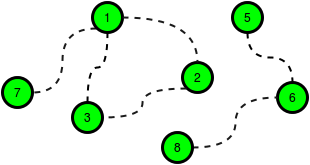

# hackerrank
HackerRank 1 month preparation kit solutions

## Week 1
### [Plus Minus](https://www.hackerrank.com/challenges/one-month-preparation-kit-plus-minus/problem?isFullScreen=true&h_l=interview&playlist_slugs%5B%5D=preparation-kits&playlist_slugs%5B%5D=one-month-preparation-kit&playlist_slugs%5B%5D=one-month-week-one)
Given an array of integers, calculate the ratios of its elements that are positive, negative, and zero. Print the decimal value of each fraction on a new line with 6 places after the decimal. 
```Java
    public static void plusMinus(List<Integer> arr) {
        int size = arr.size();
        int positives = 0, negatives = 0, zeroes = 0;
        for (Integer num : arr) {
            if (num > 0)
                positives++;
            else if (num < 0)
                negatives++;
            else
                zeroes++;
        }
        System.out.println(String.format("%.6f", (float) positives / size));
        System.out.println(String.format("%.6f", (float) negatives / size));
        System.out.println(String.format("%.6f", (float) zeroes / size));
    }
```

[Java Solution](week1/plusminus/Solution.java) | 

---
### [Mini-Max Sum](https://www.hackerrank.com/challenges/one-month-preparation-kit-mini-max-sum/problem?isFullScreen=true&h_l=interview&playlist_slugs%5B%5D=preparation-kits&playlist_slugs%5B%5D=one-month-preparation-kit&playlist_slugs%5B%5D=one-month-week-one)
Given five positive integers, find the minimum and maximum values that can be calculated by summing exactly four of the five integers. Then print the respective minimum and maximum values as a single line of two space-separated long integers. 
```Java
    public static void miniMaxSum(List<Integer> arr) {
        long min = Long.MAX_VALUE, max = Long.MIN_VALUE, sum = 0;
        for (Integer num : arr) {
            min = Math.min(min, num);
            max = Math.max(max, num);
            sum += num;
        }
        System.out.println((sum - max) + " " + (sum - min));
    }
```

[Java Solution](week1/minimax/Solution.java) |

---
### [Time Conversion](https://www.hackerrank.com/challenges/one-month-preparation-kit-time-conversion/problem?isFullScreen=true&h_l=interview&playlist_slugs%5B%5D=preparation-kits&playlist_slugs%5B%5D=one-month-preparation-kit&playlist_slugs%5B%5D=one-month-week-one)
Given a time in 12-hour AM/PM format, convert it to military (24-hour) time. 
```Java
    public static String timeConversion(String s) {
        SimpleDateFormat inputFormat = new SimpleDateFormat("hh:mm:ssa");
        SimpleDateFormat outputFormat = new SimpleDateFormat("HH:mm:ss");
        try {
            Date inputDate = inputFormat.parse(s);
            return outputFormat.format(inputDate);
        } catch (ParseException pex) { }
        return null;
    }
```

[Java Solution](week1/timeconversion/Solution.java) |

---
### [Sparse Arrays](https://www.hackerrank.com/challenges/one-month-preparation-kit-sparse-arrays/problem?isFullScreen=true&h_l=interview&playlist_slugs%5B%5D=preparation-kits&playlist_slugs%5B%5D=one-month-preparation-kit&playlist_slugs%5B%5D=one-month-week-one)
There is a collection of input strings and a collection of query strings. For each query string, determine how many times it occurs in the list of input strings. Return an array of the results. 
```Java
    public static List<Integer> matchingStrings(List<String> strings, List<String> queries) {
        List<Integer> result = new ArrayList<>();
        for (String q : queries) {
            int freq = Collections.frequency(strings, q);
            result.add(freq);
        }
        return result;
    }
```

[Java Solution](week1/sparsearray/Solution.java) |

---
### [Lonely Integer](https://www.hackerrank.com/challenges/one-month-preparation-kit-lonely-integer/problem?isFullScreen=true&h_l=interview&playlist_slugs%5B%5D=preparation-kits&playlist_slugs%5B%5D=one-month-preparation-kit&playlist_slugs%5B%5D=one-month-week-one)
Given an array of integers, where all elements but one occur twice, find the unique element.
```Java
    public static int lonelyinteger(List<Integer> a) {
        int result = 0;
        for (Integer num : a) {
            result ^= num;
        }
        return result;
    }
```

[Java Solution](week1/lonlyinteger/Solution.java) |

---
### [Flipping bits](https://www.hackerrank.com/challenges/one-month-preparation-kit-flipping-bits/problem?isFullScreen=true&h_l=interview&playlist_slugs%5B%5D=preparation-kits&playlist_slugs%5B%5D=one-month-preparation-kit&playlist_slugs%5B%5D=one-month-week-one)
You will be given a list of 32 bit unsigned integers. Flip all the bits (1->0 and 0->1) and return the result as an unsigned integer. 
```Java
    public static long flippingBits(long n) {
        return n ^ 0xffffffffL;
    }
```

[Java Solution](week1/flippingbits/Solution.java) |

---
### [Diagonal difference](https://www.hackerrank.com/challenges/one-month-preparation-kit-diagonal-difference/problem?isFullScreen=true&h_l=interview&playlist_slugs%5B%5D=preparation-kits&playlist_slugs%5B%5D=one-month-preparation-kit&playlist_slugs%5B%5D=one-month-week-one)
Given a square matrix, calculate the absolute difference between the sums of its diagonals. 
```Java
    public static int diagonalDifference(List<List<Integer>> arr) {
        int sz = arr.size();
        int sum_lr = 0, sum_rl = 0;
        for (int i = 0; i < sz; i++) {
            sum_lr += arr.get(i).get(i);
            sum_rl += arr.get(i).get(sz - i - 1);
        }
        return Math.abs(sum_lr - sum_rl);
    }
```

[Java Solution](week1/diagonaldiff/Solution.java) |

---
### [Counting sort](https://www.hackerrank.com/challenges/one-month-preparation-kit-countingsort1/problem?isFullScreen=true&h_l=interview&playlist_slugs%5B%5D=preparation-kits&playlist_slugs%5B%5D=one-month-preparation-kit&playlist_slugs%5B%5D=one-month-week-one)
**Alternative Sorting:** Another sorting method, the counting sort, does not require comparison. Instead, you create an integer array whose index range covers the entire range of values in your array to sort. Each time a value occurs in the original array, you increment the counter at that index. At the end, run through your counting array, printing the value of each non-zero valued index that number of times.
```Java
    public static List<Integer> countingSort(List<Integer> arr) {
        // Create an array filled with 100 0's
        List<Integer> result = new ArrayList<>(Collections.nCopies(100, 0));
        for (int num : arr) {
            result.set(num, result.get(num) + 1);
        }
        return result;
    }
```

[Java Solution](week1/countingsort/Solution.java) |

---
### [Pangrams](https://www.hackerrank.com/challenges/one-month-preparation-kit-pangrams/problem?isFullScreen=true&h_l=interview&playlist_slugs%5B%5D=preparation-kits&playlist_slugs%5B%5D=one-month-preparation-kit&playlist_slugs%5B%5D=one-month-week-one)
A pangram is a string that contains every letter of the alphabet. Given a sentence determine whether it is a pangram in the English alphabet. Ignore case. Return either pangram or not pangram as appropriate.
```Java
    public static String pangrams(String s) {
        for (char letter = 'a'; letter <= 'z'; letter++) {
            if (s.toLowerCase().indexOf(letter) == -1)
                return "not pangram";
        }
        return "pangram";
    }
```

[Java Solution](week1/pangrams/Solution.java) |

---
### [Permute two arrays](https://www.hackerrank.com/challenges/one-month-preparation-kit-two-arrays/problem?isFullScreen=true&h_l=interview&playlist_slugs%5B%5D=preparation-kits&playlist_slugs%5B%5D=one-month-preparation-kit&playlist_slugs%5B%5D=one-month-week-one)
There are two n-element arrays of integers, A and B. Permute them into some A' and B' such that the relation A'[i] + B'[i] >= k holds for all i where 0<=i<=n. There will be q queries consisting of A, B, and k. For each query, return YES if some permutation A', B' satisfying the relation exists. Otherwise, return NO. 

```Java
  public static String twoArrays(int k, List<Integer> A, List<Integer> B) {
        Collections.sort(A);
        Collections.sort(B, Collections.reverseOrder());
        for (int i = 0; i < A.size(); i++) {
            if (A.get(i) + B.get(i) < k)
                return "NO";
        }
        return "YES";
    }
```

[Java Solution](week1/permutearrays/Solution.java) |

---
### [Subarray division](https://www.hackerrank.com/challenges/one-month-preparation-kit-the-birthday-bar/problem?isFullScreen=true&h_l=interview&playlist_slugs%5B%5D=preparation-kits&playlist_slugs%5B%5D=one-month-preparation-kit&playlist_slugs%5B%5D=one-month-week-one)
Two children, Lily and Ron, want to share a chocolate bar. Each of the squares has an integer on it.
Lily decides to share a contiguous segment of the bar selected such that:

    * The length of the segment matches Ron's birth month, and,
    * The sum of the integers on the squares is equal to his birth day.

Determine how many ways she can divide the chocolate.

```Java
    public static int birthday(List<Integer> s, int d, int m) {
        // Sliding window technique
        int ways = 0, sum = 0;
        int winSize = m - 1;
        for (int i = 0; i < s.size(); i++) {
            sum += s.get(i);
            if (i >= winSize) {
                if (sum == d)
                    ways++;
                sum -= s.get(i - winSize);
            }
        }
        return ways;
    }
```

[Java Solution](week1/subarraydivision/Solution.java) |

---
### [XOR Strings](https://www.hackerrank.com/challenges/one-month-preparation-kit-strings-xor/problem?isFullScreen=true&h_l=interview&playlist_slugs%5B%5D=preparation-kits&playlist_slugs%5B%5D=one-month-preparation-kit&playlist_slugs%5B%5D=one-month-week-one)
Given two strings consisting of digits 0 and 1 only, find the XOR of the two strings.

```Java
    public static String stringsXOR(String s, String t) {
        String res = new String("");
        for (int i = 0; i < s.length(); i++) {
            if (s.charAt(i) == t.charAt(i))
                res += "0";
            else
                res += "1";
        }
        return res;
    }
```

[Java Solution](week1/xorstrings/Solution.java) |

---
### Mock Test

#### [Find the median]
The median of a list of numbers is essentially its middle element after sorting. The same number of
elements occur after it as before. Given a list of numbers with an odd number of elements, find the median?

```Java
    public static int findMedian(List<Integer> arr) {
        Collections.sort(arr);
        int mid = arr.size() / 2;
        return arr.get(mid);
    }
```

#### [Flipping the Matrix]
Sean invented a game involving a **2n x 2n** matrix where each cell of the matrix contains an integer. He
can reverse any of its rows or columns any number of times. The goal of the game is to maximize the sum
of the elements in the **n x n** submatrix located in the upper-left quadrant of the matrix.
Given the initial configurations for **q** matrices, help Sean reverse the rows and columns of each matrix in the
best possible way so that the sum of the elements in the matrix's upper-left quadrant is maximal.

```Java
    public static int flippingMatrix(List<List<Integer>> matrix) {
        int totalSum = 0;
        int size = matrix.size();
        for (int i = 0; i < size / 2; i++) {
            for (int j = 0; j < size / 2; j++) {
                totalSum += Math.max(
                    Math.max(matrix.get(i).get(j), matrix.get(i).get(size-1-j)),
                    Math.max(matrix.get(size-1-i).get(j), matrix.get(size-1-i).get(size-1-j))
                );
            }
        }
        return totalSum;
    }
```
---
## Week 2

### [Sales by Match](https://www.hackerrank.com/challenges/one-month-preparation-kit-sock-merchant/problem?isFullScreen=true&h_l=interview&playlist_slugs%5B%5D=preparation-kits&playlist_slugs%5B%5D=one-month-preparation-kit&playlist_slugs%5B%5D=one-month-week-two)
There is a large pile of socks that must be paired by color. Given an array of integers representing the color of each sock, determine how many pairs of socks with matching colors there are.

```Java
    public static int sockMerchant(int n, List<Integer> ar) {
        int pairs = 0;
        Collections.sort(ar);
        for (int i = 1; i < n; i++) {
            if (ar.get(i) == ar.get(i - 1)) {
                pairs++;
                i++; // jump to next pair
            }
        }
        return pairs;
    }
```

[Java Solution](week2/salesbymatch/Solution.java) |

---
### [Zig Zag Sequence](https://www.hackerrank.com/challenges/one-month-preparation-kit-zig-zag-sequence/problem?isFullScreen=true&h_l=interview&playlist_slugs%5B%5D=preparation-kits&playlist_slugs%5B%5D=one-month-preparation-kit&playlist_slugs%5B%5D=one-month-week-two)
In this challenge, the task is to debug the existing code to successfully execute all provided test files.
Given an array of distinct integers, transform the array into a zig zag sequence by permuting the array elements. A sequence will be called a zig zag sequence if the first elements in the sequence are in increasing order and the last elements are in decreasing order, where *k=(n+1)/2* . You need to find the lexicographically smallest zig zag sequence of the given array.

```Java
    public static void findZigZagSequence(int[] a, int n) {
        Arrays.sort(a);
        int mid = (n) / 2; // Change 1
        int temp = a[mid];
        a[mid] = a[n - 1];
        a[n - 1] = temp;

        int st = mid + 1;
        int ed = n - 2; // Change 2
        while (st <= ed) {
            temp = a[st];
            a[st] = a[ed];
            a[ed] = temp;
            st = st + 1;
            ed = ed - 1; // Change 3
        }
        for (int i = 0; i < n; i++) {
            if (i > 0)
                System.out.print(" ");
            System.out.print(a[i]);
        }
        System.out.println();
    }
```

[Java Solution](week2/zigzag/Main.java) |

---
### [Drawing Book](https://www.hackerrank.com/challenges/one-month-preparation-kit-drawing-book/problem?isFullScreen=true&h_l=interview&playlist_slugs%5B%5D=preparation-kits&playlist_slugs%5B%5D=one-month-preparation-kit&playlist_slugs%5B%5D=one-month-week-two)
A teacher asks the class to open their books to a page number. A student can either start turning pages from the front of the book or from the back of the book. They always turn pages one at a time. When they open the book, page 1 is always on the right side:

When they flip page 1, they see pages 2 and 3. Each page except the last page will always be printed on both sides. The last page may only be printed on the front, given the length of the book. If the book is n pages long, and a student wants to turn to page p, what is the minimum number of pages to turn? They can start at the beginning or the end of the book.

Given n and p, find and print the minimum number of pages that must be turned in order to arrive at page p. 

```Java
    public static int pageCount(int n, int p) {
        int front = p / 2;
        int back = (n - p) / 2;
        if (n % 2 == 0) // if even pages
            back = (n + 1 - p) / 2; // add 1 page
        return Math.min(front, back);
    }
```

[Java Solution](week2/drawingbook/Solution.java) |

---
### [Tower Breakers](https://www.hackerrank.com/challenges/one-month-preparation-kit-tower-breakers-1/problem?isFullScreen=true&h_l=interview&playlist_slugs%5B%5D=preparation-kits&playlist_slugs%5B%5D=one-month-preparation-kit&playlist_slugs%5B%5D=one-month-week-two)
Two players are playing a game of Tower Breakers! Player 1 always moves first, and both players always play optimally.The rules of the game are as follows:
- Initially there are *n* towers.
- Each tower is of height *m*. 
- The players move in alternating turns. 
- In each turn, a player can choose a tower of height *x* and reduce its height to *y*, where *1 <= y < x* and *y* evenly divides *x*.
- If the current player is unable to make a move, they lose the game.

Given the values of *n* and *m*, determine which player will win. If the first player wins, return 1. Otherwise, return 2.

```Java
    public static int towerBreakers(int n, int m) {
        // if height(m)=1 player 1 has no moves, so player 2 wins
        // if number of towers(n) is even player 2 wins
        // player 2 will copy every move of player 1
        // if number of towers(n) is odd player 1 wins
        return m == 1 || n % 2 == 0 ? 2 : 1;
    }
```

[Java Solution](week2/towerbreaker/Solution.java) |

---
### [Caesar Cipher](https://www.hackerrank.com/challenges/one-month-preparation-kit-caesar-cipher-1/problem?isFullScreen=true&h_l=interview&playlist_slugs%5B%5D=preparation-kits&playlist_slugs%5B%5D=one-month-preparation-kit&playlist_slugs%5B%5D=one-month-week-two)
Julius Caesar protected his confidential information by encrypting it using a cipher. Caesar's cipher shifts each letter by a number of letters. If the shift takes you past the end of the alphabet, just rotate back to the front of the alphabet. In the case of a rotation by 3, w, x, y and z would map to z, a, b and c.

```Java
    public static String caesarCipher(String s, int k) {
        String result = new String("");
        for (char ch : s.toCharArray()) {
            if (Character.isLetter(ch)) {
                char start = Character.isUpperCase(ch) ? 'A' : 'a';
                result += (char) (start + (ch - start + k) % 26);
            } else {
                result += ch;
            }
        }
        return result;
    }
```

[Java Solution](week2/caesarcipher/Solution.java) |

---
### [Max Min](https://www.hackerrank.com/challenges/one-month-preparation-kit-angry-children/problem?isFullScreen=true&h_l=interview&playlist_slugs%5B%5D=preparation-kits&playlist_slugs%5B%5D=one-month-preparation-kit&playlist_slugs%5B%5D=one-month-week-two)
You will be given a list of integers,`arr` , and a single integer `k`. You must create an array of length `k` from elements of `arr` such that its unfairness is minimized. Call that array `arr'`. Unfairness of an array is calculated as `max(arr') - min(arr')`

```Java
    public static int maxMin(int k, List<Integer> arr) {
        Collections.sort(arr);
        int minUnfairness = Integer.MAX_VALUE;
        for (int i = k - 1; i < arr.size(); i++) {
            int min = arr.get(i - k + 1);
            int max = arr.get(i);
            minUnfairness = Math.min(minUnfairness, max - min);
        }
        return minUnfairness;
    }
```

[Java Solution](week2/maxmin/Solution.java) |

---
### [Dynamic Array](https://www.hackerrank.com/challenges/one-month-preparation-kit-dynamic-array/problem?isFullScreen=true&h_l=interview&playlist_slugs%5B%5D=preparation-kits&playlist_slugs%5B%5D=one-month-preparation-kit&playlist_slugs%5B%5D=one-month-week-two)
- Declare a 2-dimensional array,`arr` , of `n` empty arrays. All arrays are zero indexed. 
- Declare an integer, `lastAnswer`, and initialize it to 0
- There are 2 types of queries, given as an array of strings for you to parse:
    1. Query: 1 x y
        1. Let `idx = ((x XOR lastAnswer) % n)`
        2. Append the integer y to `arr[idx]`
    2. Query: 2 x y
    	1. Let `idx = ((x XOR lastAnwswer) % n)`
    	2. Assign the value `arr[idx][y % size(arr[idx])]` to `lastAnswer`.
        3. Store the new value of `lastAnswer` to an answers array.

Finally, size(arr[idx]) is the number of elements in arr[idx] 

```Java
    public static List<Integer> dynamicArray(int n, List<List<Integer>> queries) {
        List<Integer> result = new ArrayList<>();
        List<List<Integer>> arr = new ArrayList<>(n);
        int lastAnswer = 0;

        // fill 2d array with empty arrays
        for (int i = 0; i < n; i++)
            arr.add(new ArrayList<>());

        for (List<Integer> query : queries) {
            int q = query.get(0);
            int x = query.get(1);
            int y = query.get(2);
            int idx = ((x ^ lastAnswer) % n);
            switch (q) {
                case 1:
                    arr.get(idx).add(y);
                    break;
                case 2:
                    lastAnswer = arr.get(idx).get(y % arr.get(idx).size());
                    result.add(lastAnswer);
                    break;
                default:
                    break;
            }
        }
        return result;
    }
}
```

[Java Solution](week2/dynamicarray/Solution.java) |

---
### [Grid Challenge](https://www.hackerrank.com/challenges/one-month-preparation-kit-grid-challenge/problem?isFullScreen=true&h_l=interview&playlist_slugs%5B%5D=preparation-kits&playlist_slugs%5B%5D=one-month-preparation-kit&playlist_slugs%5B%5D=one-month-week-two)
Given a square grid of characters in the range ascii[a-z], rearrange elements of each row alphabetically, ascending. Determine if the columns are also in ascending alphabetical order, top to bottom. Return YES if they are or NO if they are not.

```Java
    public static String gridChallenge(List<String> grid) {
        char[] previousRow = grid.get(0).toCharArray();
        Arrays.sort(previousRow);
        for (int i = 1; i < grid.size(); i++) {
            char[] currentRow = grid.get(i).toCharArray();
            Arrays.sort(currentRow);
            for (int j = 0; j < previousRow.length; j++) {
                if (previousRow[j] > currentRow[j])
                    return "NO";
            }
            previousRow = currentRow;
        }
        return "YES";
    }
```

[Java Solution](week2/gridchallange/Solution.java) |

---
### [Prime Dates](https://www.hackerrank.com/challenges/one-month-preparation-kit-prime-date/problem?isFullScreen=true&h_l=interview&playlist_slugs%5B%5D=preparation-kits&playlist_slugs%5B%5D=one-month-preparation-kit&playlist_slugs%5B%5D=one-month-week-two)
In this challenge, the task is to debug the existing code to successfully execute all provided test files. 
Given two dates each in the format dd-mm-yyyy, you have to find the number of lucky dates between them (inclusive). To see if a date is lucky,
 - Firstly, sequentially concatenate the date, month and year, into a new integer x erasing the leading zeroes.
 - Now if x is divisible by either 4 or 7, then we call the date a lucky date.
For example, let's take the date "02-08-2024". After concatinating the day, month and year, we get
x = 2082024. As x is divisible by 4 so the date "02-08-2024" is called a lucky date.

Debug the given function findPrimeDates and/or other lines of code, to find the correct lucky dates from the given input.

Note: You can modify at most five lines in the given code and you cannot add or remove lines to the code.

```Java
    public static void updateLeapYear(int year) {
        if (year % 400 == 0) {
            month[2] = 29; // change 1
        } else if (year % 100 == 0) {
            month[2] = 28; // change 2
        } else if (year % 4 == 0) {
            month[2] = 29;
        } else {
            month[2] = 28;
        }
    }

    public static void storeMonth() {
        month[1] = 31;
        month[2] = 28;
        month[3] = 31;
        month[4] = 30;
        month[5] = 31;
        month[6] = 30;
        month[7] = 31;
        month[8] = 31;
        month[9] = 30;
        month[10] = 31;
        month[11] = 30;
        month[12] = 31;
    }

    public static int findPrimeDates(int d1, int m1, int y1, int d2, int m2, int y2) {
        storeMonth();

        int result = 0;

        while (true) {
            int x = d1;
            x = x * 100 + m1;
            x = x * 10000 + y1; // change 3
            if (x % 4 == 0 || x % 7 == 0) { // change 4
                result = result + 1;
            }
            if (d1 == d2 && m1 == m2 && y1 == y2) {
                break;
            }
            updateLeapYear(y1);
            d1 = d1 + 1;
            if (d1 > month[m1]) {
                m1 = m1 + 1;
                d1 = 1;
                if (m1 > 12) {
                    y1 = y1 + 1;
                    m1 = 1; // change 5
                }
            }
        }
        return result;
    }
```

[Java Solution](week2/primedate/Main.java) |

---
### [Sherlock and Array](https://www.hackerrank.com/challenges/one-month-preparation-kit-sherlock-and-array/problem?isFullScreen=true&h_l=interview&playlist_slugs%5B%5D=preparation-kits&playlist_slugs%5B%5D=one-month-preparation-kit&playlist_slugs%5B%5D=one-month-week-two)
Watson gives Sherlock an array of integers. His challenge is to find an element of the array such that the sum of all elements to the left is equal to the sum of all elements to the right.

```Java
    public static String balancedSums(List<Integer> arr) {
        int totalSum = 0, currentSum = 0;
        for (Integer num : arr)
            totalSum += num;

        for (int i = 0; i < arr.size(); i++) {
            totalSum -= arr.get(i);
            if (currentSum == totalSum) {
                return "YES";
            }
            currentSum += arr.get(i);
        }
        return "NO";
    }
```

[Java Solution](week2/sherlockarray/Solution.java) |

---
### [Recursive Digit Sum](https://www.hackerrank.com/challenges/one-month-preparation-kit-recursive-digit-sum/problem?isFullScreen=true&h_l=interview&playlist_slugs%5B%5D=preparation-kits&playlist_slugs%5B%5D=one-month-preparation-kit&playlist_slugs%5B%5D=one-month-week-two)
We define super digit of an integer x using the following rules:

Given an integer, we need to find the super digit of the integer.
 - If x has only 1 digit, then its super digit is x
 - Otherwise, the super digit of x is equal to the super digit of the sum of the digits of x.
   
The number p is created by concatenating the string n k times so the initial 
```Java
    public static int superDigit(String n, int k) {
        if (n.length() == 1)
            return Integer.parseInt(n);

        long sum = 0;
        for (char digit : n.toCharArray()) {
            sum += Long.parseLong(String.valueOf(digit));
        }

        return superDigit(String.valueOf(sum * k), 1);
    }
```

[Java Solution](week2/recursivedigitsum/Solution.java) |

---
### [Counter game](https://www.hackerrank.com/challenges/one-month-preparation-kit-counter-game/problem?isFullScreen=true&h_l=interview&playlist_slugs%5B%5D=preparation-kits&playlist_slugs%5B%5D=one-month-preparation-kit&playlist_slugs%5B%5D=one-month-week-two)
Louise and Richard have developed a numbers game. They pick a number and check to see if it is a power of 2. If it is, they divide it by 2. If not, they reduce it by the next lower number which is a power of 2. Whoever reduces the number to 1 wins the game. Louise always starts.

Given an initial value, determine who wins the game.

```Java
    public static String counterGame(long n) {
        int turn = 0;
        while (n > 1) {
            if ((n & (n - 1)) == 0) { // check if it's a power of 2
                n = n >> 1; // division by 2
            } else {
                int p = 0;
                long v = n;
                while ((v = v >> 1) > 0) // divide by 2 up to 1
                    p++;
                n = n - (1l << p); // 2 raised to power p
            }
            turn++;
        }
        return turn % 2 == 0 ? "Richard" : "Louise";
    }
```

[Java Solution](week2/countergame/Solution.java) |

---
### [Sum vs XOR](https://www.hackerrank.com/challenges/one-month-preparation-kit-sum-vs-xor/problem?isFullScreen=true&h_l=interview&playlist_slugs%5B%5D=preparation-kits&playlist_slugs%5B%5D=one-month-preparation-kit&playlist_slugs%5B%5D=one-month-week-two)
Given an integer n, find each x such that:
- 0 <= x <= n 
- n + x = n XOR x

Return the number of x's satisfying the criteria.

```Java
    public static long sumXor(long n) {
        // Since (n + x) = (n OR X) = (n XOR x) except when both bits are 1
        // n     x    n|x    n^x     n&x
        // ---------------------------------
        // 0     0     0      0       0
        // 0     1     1      1       0
        // 1     0     1      1       0
        // 1     1     1      0 <---  1
        //
        // The strategy is to only consider when (n OR x) = (n XOR x),
        // and that only occurs when (n AND 1) == 0
        // The way we do that is to loop through all bits and drop the right
        // bit (right shift) in very iteration (n>>1). We count how many times
        // the condition (n AND 1) == 0 is met.
        // Finally we rise the counter to power of 2 to obtain the result.
        // Why power of 2? Because we have 2 possible combination for very bit
        // of n.
        //
        int counter = 0;
        while (n > 0) {
            if ((n & 1) == 0) // count only when n|x == n^x
                counter++;
            n = n >> 1; // drop right-most digit (cut the number in half)
        }

        return 1l << counter; // a nice way to rise a number to power of 2
    }
```

[Java Solution](week2/sumxor/Solution.java) |

---
### Mock Test

#### [Palindrome Index](https://www.hackerrank.com/challenges/palindrome-index/problem?isFullScreen=true)
Given a string of lowercase letters in the range ascii[a-z], determine the index of a character that can be
removed to make the string a palindrome. There may be more than one solution, but any will do. If the word
is already a palindrome or there is no solution, return -1. Otherwise, return the index of a character to
remove.

```Java
    public static int palindromeIndex(String s) {
        for(int i = 0; i < s.length() / 2; i++) {
            if (s.charAt(i) != s.charAt(s.length() - i - 1)) {
                // validate if it is a palindrome by removing last char
                if(isPalindrome(s, i, s.length() - i - 2))
                    return s.length() - i - 1;
                return i;
            }
        }
        return -1;
    }
    
    private static boolean isPalindrome(String s, int start, int end) {
        while(start++ < end--) {
            if (s.charAt(start) != s.charAt(end))
                return false;
        }
        return true;
    }
```

[Java Solution](week2/mock/palindromeIndex/Solution.java)

---
#### [Between Two Sets]
There will be two arrays of integers. Determine all integers that satisfy the following two conditions:
1. The elements of the first array are all factors of the integer being considered
2. The integer being considered is a factor of all elements of the second array
These numbers are referred to as being between the two arrays. Determine how many such numbers exist.

```Java
    public static int getTotalX(List<Integer> a, List<Integer> b) {
        int lcm = a.get(0);
        for (int i = 1; i < a.size(); i++) {
            lcm = LCM(lcm, a.get(i));
        }

        int gcd = b.get(0);
        for (int i = 1; i < b.size(); i++) {
            gcd = GCD(gcd, b.get(i));
        }

        int result = 0;
        for (int factor = lcm; factor <= gcd; factor += lcm) {
            if (gcd % factor == 0)
                result += 1;
        }

        return result;
    }

    static int GCD(int a, int b) {
        if (b == 0)
            return a;
        return GCD(b, a % b);
    }

    static int LCM(int a, int b) {
        return (a * b) / GCD(a, b);
    }
```

[Java Solution](week2/mock/betweentwosets/Solution.java)

---
#### [Anagram]
Two words are anagrams of one another if their letters can be rearranged to form the other word.
Given a string, split it into two contiguous substrings of equal length. Determine the minimum number of
characters to change to make the two substrings into anagrams of one another

```Java
    public static int anagram(String s) {
        if (s.length() % 2 != 0)
            return -1;
        String s1 = s.substring(0, s.length() / 2);
        String s2 = s.substring(s.length() / 2);

        for (Character c : s1.toCharArray()) {
            if (s2.indexOf(c) != -1) //if s2 contains c, remove it
                s2 = s2.replaceFirst(String.valueOf(c), "");
        }

        return s2.length();
    }
```
[Java Solution](week2/mock/anagram/Solution.java)

---
## Week 3

### [The Bomberman Game](https://www.hackerrank.com/challenges/one-month-preparation-kit-bomber-man/problem?h_l=interview&isFullScreen=true&playlist_slugs%5B%5D=preparation-kits&playlist_slugs%5B%5D=one-month-preparation-kit&playlist_slugs%5B%5D=one-month-week-three)
Bomberman lives in a rectangular grid. Each cell in the grid either contains a bomb or nothing at all. Each bomb can be planted in any cell of the grid but once planted, it will detonate after exactly 3 seconds. Once a bomb detonates, it's destroyed — along with anything in its four neighboring cells. This means that if a bomb detonates in cell i,j any valid cells (i +/- 1,j) and (i,j +/- 1) are cleared. If there is a bomb in a neighboring cell, the neighboring bomb is destroyed without detonating, so there's no chain reaction.

Bomberman is immune to bombs, so he can move freely throughout the grid. Here's what he does:

1. Initially, Bomberman arbitrarily plants bombs in some of the cells, the initial state.
2. After one second, Bomberman does nothing.
3. After one more second, Bomberman plants bombs in all cells without bombs, thus filling the whole grid with bombs. No bombs detonate at this point.
4. After one more second, any bombs planted exactly three seconds ago will detonate. Here, Bomberman stands back and observes.
5. Bomberman then repeats steps 3 and 4 indefinitely.

Note that during every second Bomberman plants bombs, the bombs are planted simultaneously (i.e., at the exact same moment), and any bombs planted at the same time will detonate at the same time.

Given the initial configuration of the grid with the locations of Bomberman's first batch of planted bombs, determine the state of the grid after
seconds.

```Java
    public static List<String> bomberMan(int n, List<String> grid) {
        char BOMB = 'O', DOT = '.';
        List<String> grid2 = new ArrayList<>();
        String filledBombs = new String("");
        for (int i = 0; i < grid.get(0).length(); i++) {
            filledBombs += BOMB;
        }

        List<String> filled = new ArrayList<>();
        for (int j = 0; j < grid.size(); j++) {
            filled.add(filledBombs);
        }

        /*
         * 4 possible states:
         * 
         * 1. Original grid (n = 1)
         * 2. Full of bombs (n = 2, 4, 6...)
         * 3. Detonate 1 time (n = 3, 7, 11...)
         * 4. Detonate 2 times (n = 5, 9, 13...)
         */

        if (n == 1)
            return grid;

        if ((n % 2) == 0)
            return filled;

        int maxFlips = 1;
        if (n % 4 == 1) // (n = 5, 9, 13...)
            maxFlips = 2;

        // original
        grid2.addAll(grid);

        while (maxFlips-- > 0) {
            grid.clear();
            grid.addAll(filled);
            for (int y = 0; y < grid.size(); y++) {
                for (int x = 0; x < grid.get(0).length(); x++) {
                    if (grid2.get(y).charAt(x) == BOMB) {
                        StringBuilder sb = new StringBuilder(grid.get(y));
                        sb.setCharAt(x, DOT);
                        grid.set(y, sb.toString());

                        // up
                        if (y > 0) {
                            sb = new StringBuilder(grid.get(y - 1));
                            sb.setCharAt(x, DOT);
                            grid.set(y - 1, sb.toString());
                        }
                        // down
                        if (y < grid2.size() - 1) {
                            sb = new StringBuilder(grid.get(y + 1));
                            sb.setCharAt(x, DOT);
                            grid.set(y + 1, sb.toString());
                        }
                        // left
                        if (x > 0) {
                            sb = new StringBuilder(grid.get(y));
                            sb.setCharAt(x - 1, DOT);
                            grid.set(y, sb.toString());
                        }
                        // right
                        if (x < grid.get(0).length() - 1) {
                            sb = new StringBuilder(grid.get(y));
                            sb.setCharAt(x + 1, DOT);
                            grid.set(y, sb.toString());
                        }
                    }
                }
            }
            grid2.clear();
            grid2.addAll(grid);
        }
        return grid2;
    }

```

[Java Solution](week3/bomberman/Solution.java) |

---
### [New Year Chaos](https://www.hackerrank.com/challenges/one-month-preparation-kit-new-year-chaos/problem?isFullScreen=true&h_l=interview&playlist_slugs%5B%5D=preparation-kits&playlist_slugs%5B%5D=one-month-preparation-kit&playlist_slugs%5B%5D=one-month-week-three)
It is New Year's Day and people are in line for the Wonderland rollercoaster ride. Each person wears a sticker indicating their initial position in the queue from 1 to n. Any person can bribe the person directly in front of them to swap positions, but they still wear their original sticker. One person can bribe at most two others.

Determine the minimum number of bribes that took place to get to a given queue order. Print the number of bribes, or, if anyone has bribed more than two people, print Too chaotic.
```Java
    public static void minimumBribes(List<Integer> q) {
        int swaps = 0;

        for (int index = q.size() - 1; index > 0; index--) {
            int rightValue = index + 1;
            if (q.get(index) != rightValue) {
                if (q.get(index - 1) == rightValue) {
                    q.set(index - 1, q.get(index));
                    q.set(index, rightValue);
                    swaps += 1;
                } else if (q.get(index - 2) == rightValue) {
                    q.set(index - 2, q.get(index - 1));
                    q.set(index - 1, q.get(index));
                    q.set(index, rightValue);
                    swaps += 2;
                } else {
                    System.out.println("Too chaotic");
                    return;
                }
            }
        }
        System.out.println(swaps);
    }
```

[Java Solution](week3/newyearchaos/Solution.java) |

---
### [Sherlock and the Valid String](https://www.hackerrank.com/challenges/one-month-preparation-kit-sherlock-and-valid-string/problem?isFullScreen=true&h_l=interview&playlist_slugs%5B%5D=preparation-kits&playlist_slugs%5B%5D=one-month-preparation-kit&playlist_slugs%5B%5D=one-month-week-three)
Sherlock considers a string to be valid if all characters of the string appear the same number of times. It is also valid if he can remove just 1 character at 1 index in the string, and the remaining characters will occur the same number of times. Given a string s, determine if it is valid. If so, return YES, otherwise return NO.
```Java
    public static String isValid(String s) {
        Map<Character, Integer> charMap = new HashMap<>();

        for (char ch : s.toCharArray()) {
            charMap.put(ch, charMap.getOrDefault(ch, 0) + 1);
        }

        List<Integer> list = new ArrayList<>(charMap.values());
        Collections.sort(list);

        if (s.length() == 1)
            return "YES";

        if (list.get(0) == 1)
            return list.get(1) != Collections.max(list) ? "NO" : "YES";

        if (Collections.max(list) - Collections.min(list) > 1)
            return "NO";

        return "YES";
    }
```

[Java Solution](week3/sherlockvalidstring/Solution.java) |

---
### [Climbing the Leaderboard](https://www.hackerrank.com/challenges/one-month-preparation-kit-climbing-the-leaderboard/problem?isFullScreen=true&h_l=interview&playlist_slugs%5B%5D=preparation-kits&playlist_slugs%5B%5D=one-month-preparation-kit&playlist_slugs%5B%5D=one-month-week-three)
An arcade game player wants to climb to the top of the leaderboard and track their ranking. The game uses Dense Ranking, so its leaderboard works like this:

* The player with the highest score is ranked number 1 on the leaderboard.
* Players who have equal scores receive the same ranking number, and the next player(s) receive the immediately following ranking number.
```Java
    public static List<Integer> climbingLeaderboard(List<Integer> ranked, List<Integer> player) {

        List<Integer> result = new ArrayList<>();

        // Convert ranked list to TreeSet to remove duplicates
        // and sort in ascending order
        Set<Integer> rankSet = new TreeSet<>(ranked);
        int highestRank = rankSet.size();

        // redefine ranked list with the sorted set
        ranked = new ArrayList<>(rankSet);

        for (Integer current : player) {
            // do a fast binary search in the ranked list to find
            // the insertion point of the currentplayer
            int index = Collections.binarySearch(ranked, current);

            // if the insertion point is found (aka positive index),
            // the ordinary position of the current player will
            // be located at the highestRank minus the insertion point
            int ord = highestRank - index;

            // if the insertion point is not found (aka negative index),
            // insertion point = -insertPoint - 1
            if (index < 0) {
                // the ordinary position of the current player
                // will be located at the highestRank minus the
                // the insertion point:
                // highestRank - (-insertPoint - 1) - 1
                ord = highestRank + index + 2;
            }
            result.add(ord);
        }

        return result;
    }
```

[Java Solution](week3/climbingleaderboard/Solution.java) |

---
### [Reverse a linked list](https://www.hackerrank.com/challenges/one-month-preparation-kit-reverse-a-linked-list/problem?isFullScreen=true&h_l=interview&playlist_slugs%5B%5D=preparation-kits&playlist_slugs%5B%5D=one-month-preparation-kit&playlist_slugs%5B%5D=one-month-week-three)
Given the pointer to the head node of a linked list, change the next pointers of the nodes so that their order is reversed. The head pointer given may be null meaning that the initial list is empty. 
```Java
    public static SinglyLinkedListNode reverse(SinglyLinkedListNode llist) {
        SinglyLinkedListNode prevNode = null;
        SinglyLinkedListNode currentNode = llist;

        while (currentNode != null) {
            SinglyLinkedListNode nextNode = currentNode.next;
            currentNode.next = prevNode;
            prevNode = currentNode;
            currentNode = nextNode;
        }
        return prevNode;
    }
```

[Java Solution](week3/reverselinkedlist/Solution.java) |

---
### [Reverse a doubly linked list](https://www.hackerrank.com/challenges/one-month-preparation-kit-reverse-a-doubly-linked-list/problem?isFullScreen=true&h_l=interview&playlist_slugs%5B%5D=preparation-kits&playlist_slugs%5B%5D=one-month-preparation-kit&playlist_slugs%5B%5D=one-month-week-three)
Given the pointer to the head node of a doubly linked list, reverse the order of the nodes in place. That is, change the next and prev pointers of the nodes so that the direction of the list is reversed. Return a reference to the head node of the reversed list. 
```Java
    public static DoublyLinkedListNode reverse(DoublyLinkedListNode llist) {
        DoublyLinkedListNode prevNode = null;
        DoublyLinkedListNode currentNode = llist;
        DoublyLinkedListNode nextNode = null;

        while (currentNode != null) {
            // swap pointers
            nextNode = currentNode.next;
            currentNode.next = prevNode;
            currentNode.prev = nextNode;
            // save previous
            prevNode = currentNode;
            // move along
            currentNode = nextNode;
        }
        return prevNode;
    }
```

[Java Solution](week3/reversedoublylinkedlist/Solution.java) |

---
### [Insert a node at a specific position](https://www.hackerrank.com/challenges/one-month-preparation-kit-insert-a-node-at-a-specific-position-in-a-linked-list/problem?isFullScreen=true&h_l=interview&playlist_slugs%5B%5D=preparation-kits&playlist_slugs%5B%5D=one-month-preparation-kit&playlist_slugs%5B%5D=one-month-week-three)
Given the pointer to the head node of a linked list and an integer to insert at a certain position, create a new node with the given integer as its data attribute, insert this node at the desired position and return the head node.

A position of 0 indicates head, a position of 1 indicates one node away from the head and so on. The head pointer given may be null meaning that the initial list is empty. 
```Java
    public static SinglyLinkedListNode insertNodeAtPosition(SinglyLinkedListNode llist, int data, int position) {
        int index = 0;
        SinglyLinkedListNode newNode = new SinglyLinkedListNode(data);
        SinglyLinkedListNode currentNode = llist;
        SinglyLinkedListNode previousNode = null;

        while (index++ != position) {
            previousNode = currentNode;
            currentNode = currentNode.next;
        }

        if (previousNode == null)
            return newNode;

        newNode.next = currentNode;
        previousNode.next = newNode;

        return llist;
    }
```

[Java Solution](week3/insertlinkedlist/Solution.java) |

---
### [Merge two sorted linked lists](https://www.hackerrank.com/challenges/one-month-preparation-kit-merge-two-sorted-linked-lists/problem?isFullScreen=true&h_l=interview&playlist_slugs%5B%5D=preparation-kits&playlist_slugs%5B%5D=one-month-preparation-kit&playlist_slugs%5B%5D=one-month-week-three)
Given pointers to the heads of two sorted linked lists, merge them into a single, sorted linked list. Either head pointer may be null meaning that the corresponding list is empty.
```Java
    static SinglyLinkedListNode mergeLists(SinglyLinkedListNode head1, SinglyLinkedListNode head2) {
        SinglyLinkedListNode pt1 = head1;
        SinglyLinkedListNode pt2 = head2;
        SinglyLinkedListNode merged = new SinglyLinkedListNode(-1);
        SinglyLinkedListNode pt3 = merged;

        while (pt1 != null && pt2 != null) {
            if (pt1.data < pt2.data) {
                pt3.next = new SinglyLinkedListNode(pt1.data);
                pt1 = pt1.next;
            } else {
                pt3.next = new SinglyLinkedListNode(pt2.data);
                pt2 = pt2.next;
            }
            pt3 = pt3.next;
        }

        if (pt1 != null)
            pt3.next = pt1;
        if (pt2 != null)
            pt3.next = pt2;

        return merged.next;
    }
```

[Java Solution](week3/mergedlinkedlist/Solution.java) |

---
### [Ice Cream Parlor](https://www.hackerrank.com/challenges/one-month-preparation-kit-icecream-parlor/problem?isFullScreen=true&h_l=interview&playlist_slugs%5B%5D=preparation-kits&playlist_slugs%5B%5D=one-month-preparation-kit&playlist_slugs%5B%5D=one-month-week-three)
Two friends like to pool their money and go to the ice cream parlor. They always choose two distinct flavors and they spend all of their money.

Given a list of prices for the flavors of ice cream, select the two that will cost all of the money they have. 
```Java
    public static List<Integer> icecreamParlor(int m, List<Integer> arr) {
        for (int f1 : arr) {
            int index1 = arr.indexOf(f1);
            int index2 = arr.lastIndexOf(m - f1);
            if (index1 != index2 && index2 >= 0)
                return Arrays.asList(index1 + 1, index2 + 1);
        }
        return new ArrayList<>();
    }
```

[Java Solution](week3/icecreamparlor/Solution.java) |

---
### [Queue using Two Stacks](https://www.hackerrank.com/challenges/one-month-preparation-kit-queue-using-two-stacks/problem?isFullScreen=true&h_l=interview&playlist_slugs%5B%5D=preparation-kits&playlist_slugs%5B%5D=one-month-preparation-kit&playlist_slugs%5B%5D=one-month-week-three)
A queue is an abstract data type that maintains the order in which elements were added to it, allowing the oldest elements to be removed from the front and new elements to be added to the rear. This is called a First-In-First-Out (FIFO) data structure because the first element added to the queue (i.e., the one that has been waiting the longest) is always the first one to be removed.

A basic queue has the following operations:

* Enqueue: add a new element to the end of the queue.
* Dequeue: remove the element from the front of the queue and return it.

In this challenge, you must first implement a queue using two stacks. Then process q queries, where each query is one of the following types:

1. 1: x: Enqueue element x into the end of the queue.
2. 2: Dequeue the element at the front of the queue.
3. 3: Print the element at the front of the queue.
```Java
    public static void main(String[] args) {
        Stack<String> s1 = new Stack<>();
        Stack<String> s2 = new Stack<>();

        Scanner scanner = new Scanner(System.in);
        int q = scanner.nextInt();
        scanner.nextLine();
        for (int i = 0; i < q; i++) {
            String line = scanner.nextLine();
            String[] cmd = line.split("\\s");

            switch (cmd[0]) {
                case "1":
                    s1.push(cmd[1]);
                    break;
                case "2":
                    if (s2.isEmpty()) {
                        while (!s1.isEmpty()) {
                            s2.push(s1.pop());
                        }
                    }
                    s2.pop();
                    break;
                case "3":
                    if (s2.isEmpty()) {
                        while (!s1.isEmpty()) {
                            s2.push(s1.pop());
                        }
                    }
                    System.out.println(s2.peek());
                    break;
                default:
                    break;
            }
        }
        scanner.close();
    }
```

[Java Solution](week3/queuetwostacks/Solution.java) |

---
### [Balanced Brackets](https://www.hackerrank.com/challenges/one-month-preparation-kit-balanced-brackets/problem?isFullScreen=true&h_l=interview&playlist_slugs%5B%5D=preparation-kits&playlist_slugs%5B%5D=one-month-preparation-kit&playlist_slugs%5B%5D=one-month-week-three)
A bracket is considered to be any one of the following characters: (, ), {, }, \[, or \].

Two brackets are considered to be a matched pair if the an opening bracket (i.e., (, \[, or {) occurs to the left of a closing bracket (i.e., ), \], or }) of the exact same type. There are three types of matched pairs of brackets: [], {}, and ().

A matching pair of brackets is not balanced if the set of brackets it encloses are not matched. For example, {[(])} is not balanced because the contents in between { and } are not balanced. The pair of square brackets encloses a single, unbalanced opening bracket, (, and the pair of parentheses encloses a single, unbalanced closing square bracket, ].

By this logic, we say a sequence of brackets is balanced if the following conditions are met:

* It contains no unmatched brackets.
* The subset of brackets enclosed within the confines of a matched pair of brackets is also a matched pair of brackets.

Given n strings of brackets, determine whether each sequence of brackets is balanced. If a string is balanced, return YES. Otherwise, return NO. 
```Java
    public static String isBalanced(String s) {
        Stack<Character> stack = new Stack<>();
        String opening = "[{(";
        String closing = "]})";

        for (Character b : s.toCharArray()) {
            if (closing.indexOf(b) > -1) {
                if (stack.isEmpty() || opening.charAt(closing.indexOf(b)) != stack.pop()) {
                    return "NO";
                }
            } else {
                stack.push(b);
            }
        }
        return stack.isEmpty() ? "YES" : "NO";
    }
```

[Java Solution](week3/balancedbrackets/Solution.java) |

---
### [Waiter](https://www.hackerrank.com/challenges/one-month-preparation-kit-waiter/problem?isFullScreen=true&h_l=interview&playlist_slugs%5B%5D=preparation-kits&playlist_slugs%5B%5D=one-month-preparation-kit&playlist_slugs%5B%5D=one-month-week-three)
You are a waiter at a party. There is a pile of numbered plates. Create an empty `answers` array. At each iteration, `i` , remove each plate from the top of the stack in order. Determine if the number on the plate is evenly divisible by the `ith` prime number. If it is, stack it in pile `B`. Otherwise, stack it in stack `A`. Store the values in `B` from top to bottom in `answers`. In the next iteration, do the same with the values in stack `A`. Once the required number of iterations is complete, store the remaining values in `A` in `answers`, again from top to bottom. Return the `answers` array. 
```Java
    private static List<Integer> getPrimes(int q) {
        List<Integer> primes = new ArrayList<>();
        Integer ith = 2;
        while (primes.size() < q) {
            if (new BigInteger(ith.toString()).isProbablePrime(100)) {
                primes.add(ith++);
            }
        }
        return primes;
    }

    public static List<Integer> waiter(List<Integer> number, int q) {
        List<Integer> primes = getPrimes(q);
        List<Integer> answers = new ArrayList<>();

        Stack<Integer> a = new Stack<>();
        // Stack the plates in reverse order
        a.addAll(number);

        for (int i = 0; i < q; i++) {
            Stack<Integer> tempA = new Stack<>();
            Stack<Integer> tempB = new Stack<>();
            while (!a.isEmpty()) {
                int item = a.pop();
                // Check if divisible by ith-prime
                if (item % primes.get(i) == 0)
                    tempB.push(item);
                else
                    tempA.push(item);
            }
            a = tempA;
            // Move elements to answers
            while (!tempB.isEmpty())
                answers.add(tempB.pop());
        }
        // Move remaining elements in A
        while (!a.isEmpty()) {
            answers.add(a.pop());
        }
        return answers;
    }
```

[Java Solution](week3/waiter/Solution.java) |

---
### [Simple Text Eidtor](https://www.hackerrank.com/challenges/one-month-preparation-kit-simple-text-editor/problem?isFullScreen=true&h_l=interview&playlist_slugs%5B%5D=preparation-kits&playlist_slugs%5B%5D=one-month-preparation-kit&playlist_slugs%5B%5D=one-month-week-three)
Implement a simple text editor. The editor initially contains an empty string, S. Perform Q operations of the following 4 types:

1. append(W) - Append string to the end of S.
2. delete(k) - Delete the last characters of S.
3. print(k) - Print the kth character of S.
4. undo() - Undo the last (not previously undone) operation of type 1 or 2, reverting S to the state it was in prior to that operation. 
```Java
    public static void main(String[] args) {
        Stack<String> stack = new Stack<>();
        StringBuilder textEditor = new StringBuilder();
        Scanner scanner = new Scanner(System.in);
        int q = scanner.nextInt();

        while (q-- > 0) {
            String op = scanner.next();
            switch (op) {
                case "1":
                    stack.push(textEditor.toString());
                    textEditor.append(scanner.next());
                    break;
                case "2":
                    int k1 = scanner.nextInt();
                    stack.push(textEditor.toString());
                    textEditor.delete(textEditor.length() - k1, textEditor.length());
                    break;
                case "3":
                    int k2 = scanner.nextInt();
                    System.out.println(textEditor.charAt(k2 - 1));
                    break;
                case "4":
                    textEditor = new StringBuilder(stack.pop());
                    break;
                default:
                    break;
            }
        }
        scanner.close();
    }
```

[Java Solution](week3/simpletexteditor/Solution.java) |

---
### Mock Test

#### [Truck Tour](https://www.hackerrank.com/challenges/truck-tour/problem)
Suppose there is a circle. There are N petrol pumps on that circle. Petrol pumps are numbered 0 to (N - 1) (both inclusive). You have two pieces of information corresponding to each of the petrol pump: (1) the amount of petrol that particular petrol pump will give, and (2) the distance from that petrol pump to the next petrol pump.

Initially, you have a tank of infinite capacity carrying no petrol. You can start the tour at any of the petrol pumps. Calculate the first point from where the truck will be able to complete the circle. Consider that the truck will stop at each of the petrol pumps. The truck will move one kilometer for each litre of the petrol
```Java
    public static int truckTour(List<List<Integer>> petrolpumps) {
        int start;
        for (start = 0; start < petrolpumps.size(); start++) {
            int tank = 0;
            for (int j = start; j < petrolpumps.size(); j++) {
                int fuel = petrolpumps.get(j).get(0);
                int distance = petrolpumps.get(j).get(1);
                tank += fuel - distance;
                if (tank < 0)
                    break;
            }
            if (tank >= 0)
                break;
        }
        return start;
    }
```

[Java Solution](week3/mock/trucktour/Solution.java)

---

#### [Pairs](https://www.hackerrank.com/challenges/pairs/problem)
Given an array of integers and a target value, determine the number of pairs of array elements that have a difference equal to the target value
```Java
    public static int pairs(int k, List<Integer> arr) {
        // let a, b in arr ==> a - b = k ==> a = b + k
        int cntr = 0;
        Collections.sort(arr);
        for (Integer num : arr) {
            if (Collections.binarySearch(arr, num + k) >= 0) {
                cntr++;
            }
        }
        return cntr;
    }
```

[Java Solution](week3/mock/pairs/Solution.java)

---

#### [Big Sorting](https://www.hackerrank.com/challenges/big-sorting/problem)
Consider an array of numeric strings where each string is a positive number with anywhere from 1 to 10^6 digits. Sort the array's elements in non-decreasing, or ascending order of their integer values and return the
sorted array.
```Java
    public static List<String> bigSorting(List<String> unsorted) {
        // if they have the different length then we just compare their lengths
        // else we compare the numbers
        unsorted.sort((a, b) -> a.length() != b.length() ? a.length() - b.length() : a.compareTo(b));

        return unsorted;
    }
```

[Java Solution](week3/mock/bigsorting/Solution.java)

---
## Week 4

### [Equal Stacks](https://www.hackerrank.com/challenges/one-month-preparation-kit-equal-stacks/problem?isFullScreen=true&h_l=interview&playlist_slugs%5B%5D=preparation-kits&playlist_slugs%5B%5D=one-month-preparation-kit&playlist_slugs%5B%5D=one-month-week-four)
You have three stacks of cylinders where each cylinder has the same diameter, but they may vary in height. You can change the height of a stack by removing and discarding its topmost cylinder any number of times.

Find the maximum possible height of the stacks such that all of the stacks are exactly the same height. This means you must remove zero or more cylinders from the top of zero or more of the three stacks until they are all the same height, then return the height. 
```Java
    public static int equalStacks(List<Integer> h1, List<Integer> h2, List<Integer> h3) {
        int height1 = 0, height2 = 0, height3 = 0;
        for (Integer ele : h1)
            height1 += ele;

        for (Integer ele : h2)
            height2 += ele;

        for (Integer ele : h3)
            height3 += ele;

        while (height1 != height2 || height2 != height3) {
            if (height1 >= height2 && height1 >= height3) {
                height1 -= h1.remove(0);
            } else if (height2 >= height1 && height2 >= height3) {
                height2 -= h2.remove(0);
            } else if (height3 >= height1 && height3 >= height2) {
                height3 -= h3.remove(0);
            }
        }
        return height1;
    }
```

[Java Solution](week4/equalstack/Solution.java) | 

---

### [The Maximum Subarray](https://www.hackerrank.com/challenges/one-month-preparation-kit-maxsubarray/problem?isFullScreen=true&h_l=interview&playlist_slugs%5B%5D=preparation-kits&playlist_slugs%5B%5D=one-month-preparation-kit&playlist_slugs%5B%5D=one-month-week-four)
We define subsequence as any subset of an array. We define a subarray as a contiguous subsequence in an array.

Given an array, find the maximum possible sum among:

1. all nonempty subarrays.
2. all nonempty subsequences.

Print the two values as space-separated integers on one line.

Note that empty subarrays/subsequences should not be considered. 
```Java
    public static List<Integer> maxSubarray(List<Integer> arr) {
        int maxSubarray = Integer.MIN_VALUE;
        int maxSubseq = Integer.MIN_VALUE;
        int currentSum = 0, currentSumSubseq = 0;

        for (Integer num : arr) {
            // max subarray - Kadane's Algorithm
            currentSum += num;

            if (currentSum < num)
                currentSum = num;

            if (maxSubarray < currentSum)
                maxSubarray = currentSum;

            // max subseq
            if (num >= 0) { // only add if positive
                currentSumSubseq += num;
                maxSubseq = currentSumSubseq;
            }
            if (num > maxSubseq) // corner case all negatives
                maxSubseq = num;
        }

        return Arrays.asList(maxSubarray, maxSubseq);
    }
```

[Java Solution](week4/maxsubarray/Solution.java) | 

---

### [Lego Blocks](https://www.hackerrank.com/challenges/one-month-preparation-kit-lego-blocks/problem?isFullScreen=true&h_l=interview&playlist_slugs%5B%5D=preparation-kits&playlist_slugs%5B%5D=one-month-preparation-kit&playlist_slugs%5B%5D=one-month-week-four)
You have an infinite number of 4 types of lego blocks of sizes given as (depth x height x width):

Using these blocks, you want to make a wall of height n and width m. Features of the wall are:

- The wall should not have any holes in it.
- The wall you build should be one solid structure, so there should not be a straight vertical break across all rows of bricks.
- The bricks must be laid horizontally.

How many ways can the wall be built?
```Java
    /**
     * Raise a num to an exponent and mod the result
     * NOTE: don't use Math.pow() since it will give
     * incorrect results since it does not mod the
     * intermediate results
     */
    private static long pow(long num, int exp, long mod) {
        long res = num;
        while (exp-- > 1) {
            res = (res * num) % mod;
        }
        return res;
    }

    /**
     * Strategy using Dynamic Programming:
     * 1. Create an array where each index represents the width
     * and store the number of permuations for a single row.
     * 
     * 2. Create an array where each index represents the width
     * and store the number of valid and invalid permutations for
     * the total number of rows (height)
     * 
     * 3. Create an array where each index represents the width
     * and store the number of invalid permuations of each
     * total number of rows.
     * 
     * 4. The final result will be the substracion of (2) - (3):
     * result = (valid + invalid) - (invalid)
     * 
     */
    public static int legoBlocks(int h, int w) {
        long divisor = 1000000007; // every calculation must be mod by this number

        // STEP 1:
        // Permutations for a single row is:
        // when width=0; 0 valid permutation
        // when width=1; 1 valid permutation
        // when width=2; 2 valid permutations
        // when width=3; 4 valid permutations
        // when width=4; 8 valid permutations
        // when widht=N; the sum of the previous 4 widths: (N-1) + (N-2) + (N-3) + (N-4)
        List<Long> singleRow = new ArrayList<>(Arrays.asList(0L, 1L, 2L, 4L, 8L));

        // STEP 2:
        // Total permutations for all rows:
        // when width=0; singleRow[0]^h valid permutations (always 0)
        // when width=1; singleRow[1]^h valid permutations (always 1)
        // when width=2; singleRow[2]^h valid permutations
        // when width=3; singleRow[3]^h valid permutations
        // when width=4; singleRow[4]^h valid permutations
        // when width=N; singleRow[N]^h valid permutations
        List<Long> total = new ArrayList<>(
                Arrays.asList(0L, 1L,
                        pow(2, h, divisor),
                        pow(4, h, divisor),
                        pow(8, h, divisor)));

        // Completes the singleRow and total arrays dynamically from
        // the previous values according to the above rules
        for (int i = 5; i <= w; i++) {
            long val = (singleRow.get(i - 1) + singleRow.get(i - 2) +
                    singleRow.get(i - 3) + singleRow.get(i - 4)) % divisor;
            singleRow.add(val);

            total.add(pow(val, h, divisor));
        }

        // STEP 3 Invalid permutations:
        // Perform a vertical cut across all rows of bricks
        // when width=0; 0 invalid permutations
        // when width=1; 0 invalid permutations
        List<Long> invalid = new ArrayList<>(Arrays.asList(0L, 0L));

        // This is the tricky part:
        // Starting with a 2-width cut up to the width
        // For each cut, walk 1-width at a time up to the cut
        // and add the result of the left * right (invalid permutations)
        // the left part are the valid permutations
        // the right part are all possible permutations (valid and invalid)
        for (int cut = 2; cut <= w; cut++) {
            long anum = 0;
            for (int i = 1; i < cut; i++) {
                long l = total.get(i) - invalid.get(i);
                long r = total.get(cut - i);
                anum += ((l * r) % divisor);
            }
            invalid.add(anum % divisor);
        }

        // STEP 4
        // We have finally calculated all the valid and invalid permuations
        // we only substract the invalid permutations from the total permuations
        long r = (total.get(w) - invalid.get(w)) % divisor;

        // In case the substraction is negative
        // add the divisor(mod) to the result to find out the real value
        while (r < 0)
            r += divisor;

        return (int) r;
    }

```

[Java Solution](week4/legoblocks/Solution.java) | 

---

### [QHEAP1](https://www.hackerrank.com/challenges/one-month-preparation-kit-qheap1/problem?isFullScreen=true&h_l=interview&playlist_slugs%5B%5D=preparation-kits&playlist_slugs%5B%5D=one-month-preparation-kit&playlist_slugs%5B%5D=one-month-week-four)
This question is designed to help you get a better understanding of basic heap operations.

There are 3 types of query:

* "1 v" - Add an element v to the heap.
* "2 v" - Delete the element v from the heap.
* "3" - Print the minimum of all the elements in the heap.

NOTE: It is guaranteed that the element to be deleted will be there in the heap. Also, at any instant, only distinct elements will be in the heap.
```Java
   static class MyHeap {
        private long[] items;
        private int capacity = 10;
        private int size;

        private int leftIndex(int index) {
            return index * 2 + 1;
        }

        private int rightIndex(int index) {
            return index * 2 + 2;
        }

        private int parentIndex(int index) {
            return (index - 1) / 2;
        }

        private long getLeftNode(int index) {
            return items[leftIndex(index)];
        }

        private long getRightNode(int index) {
            return items[rightIndex(index)];
        }

        private long getParentNode(int index) {
            return items[parentIndex(index)];
        }

        private boolean hasLeftNode(int index) {
            return leftIndex(index) < size;
        }

        private boolean hasRightNode(int index) {
            return rightIndex(index) < size;
        }

        private boolean hasParentNode(int index) {
            return parentIndex(index) >= 0;
        }

        public MyHeap() {
            this.size = 0;
            this.items = new long[capacity];
        }

        public void add(int item) {
            checkCapacity();
            this.items[size] = item;
            this.size += 1;
            heapifyUp();
        }

        public long poll() {
            long head = items[0];
            swap(0, size - 1);
            size -= 1;
            heapifyDown();

            return head;
        }

        public long peek() {
            long item = items[0];
            return item;
        }

        public void remove(int item) {
            int index = search(item);
            swap(index, size - 1);
            size -= 1;
            heapifyDown(index);
        }

        public int search(int item) {
            for (int i = 0; i < size; i++) {
                if (item == items[i])
                    return i;
            }
            return -1;
        }

        private void checkCapacity() {
            if (size >= capacity) { // grow
                this.capacity *= 2;
                long[] newItems = new long[capacity];
                for (int i = 0; i < size; i++) {
                    newItems[i] = items[i];
                }
                this.items = newItems;
            }
        }

        private void swap(int indexOne, int indexTwo) {
            long tmp = this.items[indexOne];
            this.items[indexOne] = this.items[indexTwo];
            this.items[indexTwo] = tmp;
        }

        private void heapifyUp() {
            int index = size - 1;
            while (hasParentNode(index) && getParentNode(index) > items[index]) {
                swap(parentIndex(index), index);
                index = parentIndex(index);
            }
        }

        private void heapifyDown() {
            heapifyDown(0);
        }

        private void heapifyDown(int currentIndex) {
            while (hasLeftNode(currentIndex)) {
                int smallerChildIndex = leftIndex(currentIndex);
                if (hasRightNode(currentIndex) && getRightNode(currentIndex) < getLeftNode(currentIndex)) {
                    smallerChildIndex = rightIndex(currentIndex);
                }

                if (items[smallerChildIndex] < items[currentIndex]) {
                    swap(currentIndex, smallerChildIndex);
                }
                currentIndex = smallerChildIndex;
            }
        }

    }

    public static void main(String[] args) throws IOException {
        Scanner scanner = new Scanner(System.in);
        // PriorityQueue<Integer> pq = new PriorityQueue<>();
        Solution.MyHeap pq = new Solution.MyHeap();
        int Q = scanner.nextInt();
        while (Q-- > 0) {
            int op = scanner.nextInt();
            switch (op) {
                case 1: // add
                    pq.add(scanner.nextInt());
                    break;
                case 2: // delete
                    pq.remove(scanner.nextInt());
                    break;
                default: // print
                    System.out.println(pq.peek());
            }
        }
        scanner.close();
    }
```

[Java Solution](week4/qheap1/Solution.java) | 

---

### [Jesse and Cookies](https://www.hackerrank.com/challenges/one-month-preparation-kit-jesse-and-cookies/problem?isFullScreen=true&h_l=interview&playlist_slugs%5B%5D=preparation-kits&playlist_slugs%5B%5D=one-month-preparation-kit&playlist_slugs%5B%5D=one-month-week-four)
Jesse loves cookies and wants the sweetness of some cookies to be greater than value k. To do this, two cookies with the least sweetness are repeatedly mixed. This creates a special combined cookie with:

sweetness = (1 x Least sweet cookie + 2 x 2nd least sweet cookie).

This occurs until all the cookies have a sweetness >= k.

Given the sweetness of a number of cookies, determine the minimum number of operations required. If it is not possible, return -1.
```Java
    public static int cookies(int k, List<Integer> A) {
        int iterations = 0;
        PriorityQueue<Integer> pq = new PriorityQueue<>(A);

        while (pq.peek() < k && pq.size() >= 2) {
            iterations += 1;
            int sweetness = pq.poll() + 2 * pq.poll();
            pq.offer(sweetness);
        }
        return pq.peek() >= k ? iterations : -1;
    }
```

[Java Solution](week4/jessecookies/Solution.java) | 

---

### [Hackerland Radio Transmitters](https://www.hackerrank.com/challenges/one-month-preparation-kit-hackerland-radio-transmitters/problem?isFullScreen=true&h_l=interview&playlist_slugs%5B%5D=preparation-kits&playlist_slugs%5B%5D=one-month-preparation-kit&playlist_slugs%5B%5D=one-month-week-four)
Hackerland is a one-dimensional city with houses aligned at integral locations along a road. The Mayor wants to install radio transmitters on the roofs of the city's houses. Each transmitter has a fixed range meaning it can transmit a signal to all houses within that number of units distance away.

Given a map of Hackerland and the transmission range, determine the minimum number of transmitters so that every house is within range of at least one transmitter. Each transmitter must be installed on top of an existing house.
```Java
    public static int hackerlandRadioTransmitters(List<Integer> x, int k) {
        int transmitter = 0;
        Collections.sort(x);
        int index = 0;
        while (index < x.size()) {
            int house = x.get(index) + k;
            while (index < x.size() && x.get(index) <= house) {
                index++;
            }
            transmitter++;

            house = x.get(index - 1) + k;
            while (index < x.size() && x.get(index) <= house) {
                index++;
            }
        }
        return transmitter;
    }
```

[Java Solution](week4/hackerlandradio/Solution.java) | 

---

### [Queries with fixed length](https://www.hackerrank.com/challenges/one-month-preparation-kit-queries-with-fixed-length/problem?isFullScreen=true&h_l=interview&playlist_slugs%5B%5D=preparation-kits&playlist_slugs%5B%5D=one-month-preparation-kit&playlist_slugs%5B%5D=one-month-week-four)
Consider an n-integer sequence, *A = {a0, a1,...an-1}*. We perform a query on A by using an integer, a, to calculate the result of the following expression:


In other words, if we let *mi = max(ai,ai+1,ai+2,...ai+d-1)*, then you need to calculate *min(m0,m1,...,mn-d)*.

Given arr and q queries, return a list of answers to each query.
```Java
    public static List<Integer> solve(List<Integer> arr, List<Integer> queries) {
        List<Integer> result = new ArrayList<>();
        for (int d : queries) {
            int min = Integer.MAX_VALUE;

            for (int i = 0; i <= arr.size() - d; i++) {
                int max = Integer.MIN_VALUE;
                int upper = i + d;

                for (int j = i; j < upper; j++) {
                    if (max < arr.get(j)) {
                        max = arr.get(j);
                        i = j; // jump to index of max value
                    }
                }
                if (min > max) {
                    min = max;
                }
            }
            result.add(min);
        }
        return result;
    }
```

[Java Solution](week4/queriesfixedlength/Solution.java) | 

---

### [Array Manipulation](https://www.hackerrank.com/challenges/one-month-preparation-kit-crush/problem?isFullScreen=true&h_l=interview&playlist_slugs%5B%5D=preparation-kits&playlist_slugs%5B%5D=one-month-preparation-kit&playlist_slugs%5B%5D=one-month-week-four)
Starting with a 1-indexed array of zeros and a list of operations, for each operation add a value to each the array element between two given indices, inclusive. Once all operations have been performed, return the maximum value in the array. 
```Java
    /*
    queries = [[1,5,3], [4,8,7],[6,10,1]]
    n = 10

    |             |      optimal approach       |       |
    | array index | [1,5,3] | [4,8,7] | [6,9,1] | Total |
    |    1        |    3    |         |         |   3   |
    |    2        |         |         |         |       |
    |    3        |         |         |         |       |
    |    4        |         |    7    |         |   7   |
    |    5        |   -3    |         |         |  -3   |
    |    6        |         |         |    1    |   1   |
    |    7        |         |         |         |       |
    |    8        |         |         |         |       |
    |    9        |         |   -7    |         |  -7   |
    |    10       |         |         |         |       |
    |    10+1     |         |         |   -1    |  -1   |
     */
    public static long arrayManipulation(int n, List<List<Integer>> queries) {
        Map<Integer, Long> sum = new TreeMap<>(); // order by key
        for (List<Integer> list : queries) {
            int a = list.get(0);
            int b = list.get(1);
            long k = list.get(2);
            sum.put(a, sum.getOrDefault(a, 0L) + k);
            sum.put(b + 1, sum.getOrDefault(b + 1, 0L) - k);
        }

        long max = 0L;
        long current = 0L;
        for (long value : sum.values()) {
            current += value;
            max = Math.max(max, current);
        }
        return max;
    }
```

[Java Solution](week4/arraymanipulation/Solution.java) | 

---

### [Highest Value Palindrome](https://www.hackerrank.com/challenges/one-month-preparation-kit-richie-rich/problem?isFullScreen=true&h_l=interview&playlist_slugs%5B%5D=preparation-kits&playlist_slugs%5B%5D=one-month-preparation-kit&playlist_slugs%5B%5D=one-month-week-four)
Palindromes are strings that read the same from the left or right, for example madam or 0110.

You will be given a string representation of a number and a maximum number of changes you can make. Alter the string, one digit at a time, to create the string representation of the largest number possible given the limit to the number of changes. The length of the string may not be altered, so you must consider
0's left of all higher digits in your tests. For example 0110 is valid, 0011 is not.

Given a string representing the starting number, and a maximum number of changes allowed, create the largest palindromic string of digits possible or the string '-1' if it is not possible to create a palindrome under the contstraints. 
```Java
    public static String highestValuePalindrome(String s, int n, int k) {
        StringBuilder sb = new StringBuilder(s);
        int mismatch = 0;

        // find all mismatch chars in string
        for (int i = 0; i < n / 2; i++) {
            if (sb.charAt(i) != sb.charAt(n - i - 1))
                mismatch++;
        }

        // more mismatches than allowed changes
        if (mismatch > k)
            return "-1";

        int remain = k - mismatch; // remaining extra changes

        for (int i = 0; i < n / 2; i++) {
            char left = sb.charAt(i);
            char right = sb.charAt(n - i - 1);

            if (left == right) {
                if (left != '9' && remain >= 2) {
                    sb.setCharAt(i, '9');
                    sb.setCharAt(n - i - 1, '9');
                    remain -= 2;
                }
            } else {
                if (left != '9' && right != '9' && remain > 0) {
                    sb.setCharAt(i, '9');
                    sb.setCharAt(n - i - 1, '9');
                    remain -= 1;
                } else {
                    if (left > right) {
                        sb.setCharAt(n - i - 1, left);
                    } else {
                        sb.setCharAt(i, right);
                    }
                }
            }
        }

        if (n % 2 == 1 && remain > 0) {
            sb.setCharAt(n / 2, '9');
        }

        return sb.toString();
    }

```

[Java Solution](week4/highestvaluepalindrome/Solution.java) | 

---

### [Lily's Homework](https://www.hackerrank.com/challenges/one-month-preparation-kit-lilys-homework/problem?isFullScreen=true&h_l=interview&playlist_slugs%5B%5D=preparation-kits&playlist_slugs%5B%5D=one-month-preparation-kit&playlist_slugs%5B%5D=one-month-week-four)
Whenever George asks Lily to hang out, she's busy doing homework. George wants to help her finish it faster, but he's in over his head! Can you help George understand Lily's homework so she can hang out with him?

Consider an array of n distinct integers, *arr = [a[0], a[1],...,a[n-1]]*. George can swap any two elements of the array any number of times. An array is beautiful if the sum of *|arr[i] - arr[i-1]|* among *0 < i < n* is minimal.

Given the array *arr*, determine and return the minimum number of swaps that should be performed in order to make the array beautiful.
```Java
    public static int lilysHomework(List<Integer> arr) {
        int swaps_asc = 0;
        int swaps_desc = 0;

        Map<Integer, Integer> map1 = new HashMap<>();
        Map<Integer, Integer> map2 = new HashMap<>();

        for (int i = 0; i < arr.size(); i++) {
            map1.put(arr.get(i), i);
            map2.put(arr.get(i), i);
        }

        List<Integer> arr2 = new ArrayList<>(arr);

        List<Integer> list_asc = new ArrayList<>(arr);
        Collections.sort(list_asc);

        int n = arr.size();

        for (int i = 0; i < arr.size(); i++) {
            if (list_asc.get(i) != arr.get(i)) {
                int index = map1.get(list_asc.get(i));

                map1.put(arr.get(i), index);
                map1.put(list_asc.get(i), i);

                arr.set(index, arr.get(i));
                arr.set(i, list_asc.get(i));

                swaps_asc++;
            }

            if (list_asc.get(n - i - 1) != arr2.get(i)) {
                int index = map2.get(list_asc.get(n - i - 1));

                map2.put(arr2.get(i), index);
                map2.put(list_asc.get(n - i - 1), i);

                arr2.set(index, arr2.get(i));
                arr2.set(i, list_asc.get(n - i - 1));

                swaps_desc++;
            }
        }

        return Math.min(swaps_asc, swaps_desc);
    }
```

[Java Solution](week4/lilyshomework/Solution.java) | 

---

### [Tree: Preorder Traversal](https://www.hackerrank.com/challenges/one-month-preparation-kit-tree-preorder-traversal/problem?isFullScreen=true&h_l=interview&playlist_slugs%5B%5D=preparation-kits&playlist_slugs%5B%5D=one-month-preparation-kit&playlist_slugs%5B%5D=one-month-week-four)
Complete the *preOrder* function in the editor below, which has parameter: a pointer to the root of a binary tree. It must print the values in the tree's preorder traversal as a single line of space-separated values. 
```Java
    public static void preOrder(Node root) {
        if (root == null) {
            return;
        }
        // visit the root
        System.out.print(root.data + " ");
        // traverse the left
        preOrder(root.left);
        // traverse the right
        preOrder(root.right);
    }
```

[Java Solution](week4/preordertraversal/Solution.java) | 

---

### [Tree: Huffman Decoding](https://www.hackerrank.com/challenges/one-month-preparation-kit-tree-huffman-decoding/problem?isFullScreen=true&h_l=interview&playlist_slugs%5B%5D=preparation-kits&playlist_slugs%5B%5D=one-month-preparation-kit&playlist_slugs%5B%5D=one-month-week-four)
Huffman coding assigns variable length codewords to fixed length input characters based on their frequencies. More frequent characters are assigned shorter codewords and less frequent characters are assigned longer codewords. All edges along the path to a character contain a code digit. If they are on the left side of the tree, they will be a 0 (zero). If on the right, they'll be a 1 (one). Only the leaves will contain a letter and its frequency count. All other nodes will contain a null instead of a character, and the count of the frequency of all of it and its descendant characters.

For instance, consider the string ABRACADABRA. There are a total of 11 characters in the string. This number should match the count in the ultimately determined root of the tree. Our frequencies are *A=5, B=2,R=2, C=1* and *D=1*. The two smallest frequencies are for *C* and *D*, both equal to 1, so we'll create a tree with them. The root node will contain the sum of the counts of its descendants, in this case 1 + 1 = 2. The left node will be the first character encountered, *C*, and the right will contain *D*. Next we have 2 items with a character count of 2: the tree we just created, the character *B* and the character *R*. The tree came first, so it will go on the left of our new root node. *B* will go on the right. Repeat until the tree is complete, then fill in the 1's and 0's for the edges. The finished graph looks like: 

Input characters are only present in the leaves. Internal nodes have a character value of ϕ (NULL). We can determine that our values for characters are: 

To decode the encoded string, follow the zeros and ones to a leaf and return the character there.

You are given pointer to the root of the Huffman tree and a binary coded string to decode. You need to print the decoded string.

```Java
    public void decode(String s, Node root) {
        Node current = root;
        for (char c : s.toCharArray()) {
            if (c == '0') {
                current = current.left;
            } else {
                current = current.right;
            }

            if (current != null && current.data != '\0') {
                System.out.print(current.data);
                current = root;
            }
        }
    }
```

[Java Solution](week4/huffmandecoding/Solution.java) | 

---

### [Binary Search Tree: Lowest Common Ancestor](https://www.hackerrank.com/challenges/one-month-preparation-kit-binary-search-tree-lowest-common-ancestor/problem?isFullScreen=true&h_l=interview&playlist_slugs%5B%5D=preparation-kits&playlist_slugs%5B%5D=one-month-preparation-kit&playlist_slugs%5B%5D=one-month-week-four)
You are given pointer to the root of the binary search tree and two values *v1* and *v2*. You need to return the lowest common ancestor (LCA) of *v1* and *v2* in the binary search tree. 
```Java
    public static Node lca(Node root, int v1, int v2) {
        if (v1 > root.data && v2 > root.data)
            return lca(root.right, v1, v2);

        if (v1 < root.data && v2 < root.data)
            return lca(root.left, v1, v2);

        return root;
    }
```

[Java Solution](week4/bstlowestcommonancestor/Solution.java) | 

---

### [No Prefix Set](https://www.hackerrank.com/challenges/one-month-preparation-kit-no-prefix-set/problem?isFullScreen=true&h_l=interview&playlist_slugs%5B%5D=preparation-kits&playlist_slugs%5B%5D=one-month-preparation-kit&playlist_slugs%5B%5D=one-month-week-four)
There is a given list of strings where each string contains only lowercase letters from *a-j*, inclusive. The set of strings is said to be a GOOD SET if no string is a prefix of another string. In this case, print GOOD SET. Otherwise, print BAD SET on the first line followed by the string being checked.

Note If two strings are identical, they are prefixes of each other.
```Java
    public static void noPrefix(List<String> words) {
        Trie trie = new Trie();
        for (String word : words) {
            if (!trie.insertNoDuplicates(word)) {
                System.out.println("BAD SET");
                System.out.println(word);
                return;
            }
        }

        System.out.println("GOOD SET");
    }

    static class Trie {
        static class TrieNode {
            TrieNode[] child;
            boolean isEndOfword;

            public TrieNode() {
                child = new TrieNode[26];
                isEndOfword = false;
            }
        }

        TrieNode root;

        public Trie() {
            root = new TrieNode();
        }

        public boolean insertNoDuplicates(String word) {
            TrieNode curr = root;
            for (int i = 0; i < word.length(); i++) {
                int index = word.charAt(i) - 'a';

                // check if already contains a complete word
                if (curr.child[index] != null && curr.child[index].isEndOfword)
                    return false;

                // check if current word is a complete word
                if (curr.child[index] != null && i == word.length() - 1)
                    return false;

                if (curr.child[index] == null)
                    curr.child[index] = new TrieNode();

                curr = curr.child[index];
            }
            curr.isEndOfword = true;

            return true;
        }
    }

```

[Java Solution](week4/noprefixset/Solution.java) | 

---

### [Castle on the Grid](https://www.hackerrank.com/challenges/one-month-preparation-kit-castle-on-the-grid/problem?isFullScreen=true&h_l=interview&playlist_slugs%5B%5D=preparation-kits&playlist_slugs%5B%5D=one-month-preparation-kit&playlist_slugs%5B%5D=one-month-week-four)
You are given a square grid with some cells open (.) and some blocked (X). Your playing piece can move along any row or column until it reaches the edge of the grid or a blocked cell. Given a grid, a start and a goal, determine the minmum number of moves to get to the goal. 
```Java
    public static int minimumMoves(List<String> grid, int startX, int startY, int goalX, int goalY) {

        int[][] neighbours = { { 0, -1 }, { 0, 1 }, { 1, 0 }, { -1, 0 } };
        int rows = grid.size();
        int cols = grid.get(0).length();

        boolean[][] visited = new boolean[rows][cols];
        Node[][] previous = new Node[rows][cols];
        Queue<Node> q = new LinkedList<>();

        visited[startX][startY] = true;
        q.offer(new Node(startX, startY));

        while (!q.isEmpty()) {
            Node current = q.poll();

            for (int[] neighbour : neighbours) {
                int nextX = current.x;
                int nextY = current.y;

                while (true) {
                    nextX += neighbour[0];
                    nextY += neighbour[1];

                    // guard out of bounds
                    if ((nextX < 0 || nextX >= rows) || nextY < 0 || nextY >= cols)
                        break;

                    // if blocked, stop and continue next direction
                    boolean isBlocked = grid.get(nextX).charAt(nextY) == 'X';
                    if (isBlocked)
                        break;

                    // if not visited
                    if (!visited[nextX][nextY]) {
                        Node newNode = new Node(nextX, nextY);
                        visited[nextX][nextY] = true;
                        previous[nextX][nextY] = current;
                        q.offer(newNode);
                    }

                    // if found, count previous nodes and exits
                    if (nextX == goalX && nextY == goalY) {
                        int counter = 0;
                        Node node = previous[goalX][goalY];
                        while (node != null) {
                            node = previous[node.x][node.y];
                            counter++;
                        }

                        return counter;
                    }
                }
            }
        }

        return -1;

    }

    static class Node {
        int x;
        int y;

        public Node(int x, int y) {
            this.x = x;
            this.y = y;
        }
    }
```

[Java Solution](week4/castlegrid/Solution.java) | 

---

### [Roads and Libraries](https://www.hackerrank.com/interview/preparation-kits/one-month-preparation-kit/one-month-week-four/challenges](https://www.hackerrank.com/challenges/one-month-preparation-kit-torque-and-development/problem?isFullScreen=true&h_l=interview&playlist_slugs%5B%5D=preparation-kits&playlist_slugs%5B%5D=one-month-preparation-kit&playlist_slugs%5B%5D=one-month-week-four))
Determine the minimum cost to provide library access to all citizens of HackerLand. There are *n* cities numbered from *1* to *n*. Currently there are no libraries and the cities are not connected. Bidirectional roads may be built between any city pair listed in *cities*. A citizen has access to a library if:

* Their city contains a library.
* They can travel by road from their city to a city containing a library.

Example

The following figure is a sample map of HackerLand where the dotted lines denote possible roads:



The cost of building any road is *cc_road = 2* , and the cost to build a library in any city is *cc_lib = 3*. Build 5 roads at a cost of *5 x 2 = 10* and 2 libraries for a cost of *6*. One of the available roads in the cycle *1 --> 2 --> 3 --> 1* is not necessary. 

```Java
    public static long roadsAndLibraries(int n, int c_lib, int c_road, List<List<Integer>> cities) {
        // If the cost of road is greater than a library
        // then it is better to build a library in each city
        if (c_road >= c_lib)
            return (long) n * c_lib;

        int roadCount = 0;
        UnionFind uf = new UnionFind(n);

        for (List<Integer> edge : cities) {
            int from = edge.get(0) - 1; // starts at index 0
            int to = edge.get(1) - 1; // starts at index 0

            if (!uf.isConnected(from, to)) {
                uf.union(from, to);
                roadCount++; // build a new road
            }
        }

        // count all disjoint sets
        int components = uf.getComponents();

        // build a library for each component and
        // add the cost of each road
        long result = (long) components * c_lib + (long) roadCount * c_road;

        return result;
    }

    static class UnionFind {
        int[] parent;
        int disjointSets;

        public UnionFind(int n) {
            parent = new int[n];
            disjointSets = n;
            // Initialize the parent array with each element
            // as its own representative
            for (int i = 0; i < n; i++) {
                parent[i] = i;
            }
        }

        // Find the rep (root) of the set that includes element i
        public int find(int i) {
            // I am the parent
            if (parent[i] == i)
                return i;

            // Recursively find the rep of the parent until reaching the root
            parent[i] = find(parent[i]); // Path-compression
            return parent[i];
        }

        // Determines if element i and j are in the same set
        public boolean isConnected(int i, int j) {
            return find(i) == find(j);
        }

        public void union(int i, int j) {
            int rootI = find(i);
            int rootJ = find(j);

            // if the same root, then they are in the same set
            if (rootI == rootJ)
                return;
            // Sets the parent to either set
            parent[rootI] = rootJ;

            // we have one less component or set
            disjointSets--;
        }

        public int getComponents() {
            return disjointSets;
        }
    }

```

[Java Solution](week4/roadslibraries/Solution.java) | 

---
### Mock Test

#### [Breadth First Search: Shortest Reach](https://www.hackerrank.com/challenges/bfsshortreach/problem)
Consider an undirected graph where each edge weighs 6 units. Each of the nodes is labeled consecutively from 1 to n.

You will be given a number of queries. For each query, you will be given a list of edges describing an undirected graph. After you create a representation of the graph, you must determine and report the shortest distance to each of the other nodes from a given starting position using the breadth-first search algorithm (BFS). Return an array of distances from the start node in node number order. If a node is unreachable, return -1 for that node. 

```Java
    public static List<Integer> bfs(int n, int m, List<List<Integer>> edges, int s) {
        List<List<Integer>> graph = new ArrayList<>();
        for (int i = 0; i < n; i++) {
            graph.add(new LinkedList<>());
        }

        for (List<Integer> edge : edges) {
            int src = edge.get(0) - 1; // index 0
            int dst = edge.get(1) - 1; // index 0
            graph.get(src).add(dst);
            graph.get(dst).add(src);
        }

        List<Integer> distance = new ArrayList<>(Collections.nCopies(n, Integer.MAX_VALUE));
        PriorityQueue<Integer> queue = new PriorityQueue<>();
        queue.add(s - 1);
        distance.set(s - 1, 0);

        while (!queue.isEmpty()) {
            int u = queue.poll();
            for (Integer v : graph.get(u)) {
                if (distance.get(u) + 6 < distance.get(v)) {
                    distance.set(v, distance.get(u) + 6);
                    queue.add(v);
                }
            }
        }
        distance.replaceAll(ele -> ele == Integer.MAX_VALUE ? -1 : ele);
        distance.removeIf(ele -> ele == 0);
        return distance;
    }
```

[Java Solution](week4/mock/bfs/Solution.java) 

---

#### [Components in a graph](https://www.hackerrank.com/challenges/components-in-graph/problem)
There are *2 x N* nodes in an undirected graph, and a number of edges connecting some nodes. In each edge, the first value will be between 1 and N, inclusive. The second node will be between *N + 1* and *2 x N*, inclusive. Given a list of edges, determine the size of the smallest and largest connected components that have 2 or more nodes. A node can have any number of connections. The highest node value will always be connected to at least 1 other node.

Note Single nodes should not be considered in the answer. 

```Java
    public static List<Integer> componentsInGraph(List<List<Integer>> gb) {
        int maxNodes = Integer.MIN_VALUE;

        for (List<Integer> edge : gb) {
            maxNodes = Math.max(maxNodes, edge.get(1));
        }

        UnionFind uf = new UnionFind(maxNodes);

        for (List<Integer> edge : gb) {
            int left = edge.get(0) - 1;
            int right = edge.get(1) - 1;
            uf.union(left, right);
        }

        int min = Integer.MAX_VALUE;
        int max = Integer.MIN_VALUE;

        for (Integer i : uf.size) {
            if (i <= 1)
                continue;
            min = Math.min(min, i);
            max = Math.max(max, i);
        }

        return Arrays.asList(min, max);
    }

    static class UnionFind {
        int[] parents;
        int[] size;

        public UnionFind(int n) {
            parents = new int[n];
            size = new int[n];
            for (int i = 0; i < n; i++) {
                parents[i] = i;
                size[i] = 1;
            }

        }

        public int find(int i) {
            if (parents[i] == i)
                return i;

            parents[i] = find(parents[i]);

            return parents[i];
        }

        public void union(int i, int j) {
            int irep = find(i);
            int jrep = find(j);

            if (irep == jrep)
                return;

            int isize = size[irep];
            int jsize = size[jrep];

            if (isize < jsize) {
                parents[irep] = jrep;
                size[jrep] += size[irep];
                size[irep] = 0;
            } else {
                parents[jrep] = irep;
                size[irep] += size[jrep];
                size[jrep] = 0;
            }

            return;
        }
    }
```

[Java Solution](week4/mock/componentsingraph/Solution.java) 

---

#### [Cut the tree](https://www.hackerrank.com/challenges/cut-the-tree/problem)
There is an undirected tree where each vertex is numbered from 1 to n, and each contains a data value. The sum of a tree is the sum of all its nodes' data values. If an edge is cut, two smaller trees are formed. The difference between two trees is the absolute value of the difference in their sums.

Given a tree, determine which edge to cut so that the resulting trees have a minimal difference between them, then return that difference.

Example
*data = [1,2,3,4,5,6]*
*edges = [(1,2),(1,3),(2,6),(3,4),(3,5)]*

In this case, node numbers match their weights for convenience. The graph is shown below. 


The values are calculated as follows: 
```
Edge    Tree 1  Tree 2  Absolute
Cut     Sum      Sum     Difference
1        8         13         5
2        9         12         3
3        6         15         9
4        4         17        13
5        5         16        11
```
The minimum absolute difference is 3.

Note: The given tree is always rooted at vertex 1. 

```Java
    public static int cutTheTree(List<Integer> data, List<List<Integer>> edges) {
        int totalSum = 0;
        int diff = Integer.MAX_VALUE;
        // Create Graph
        Map<Integer, List<Integer>> graph = new HashMap<>();
        for (int i = 0; i < data.size(); i++) {
            graph.put(i + 1, new ArrayList<>());
            totalSum += data.get(i);
        }
        for (List<Integer> edge : edges) {
            int u = edge.get(0);
            int v = edge.get(1);
            graph.get(u).add(v);
            graph.get(v).add(u);
        }

        // DFS
        Set<Integer> visited = new HashSet<>();
        Stack<Integer> stack = new Stack<>();
        Map<Integer, Integer> cum_weight = new HashMap<>();
        Map<Integer, Integer> child_parent = new HashMap<>();

        // visited.add(1);
        stack.add(1);

        while (!stack.isEmpty()) {
            int vertex = stack.peek();

            if (visited.contains(vertex)) {
                cum_weight.put(vertex, data.get(vertex - 1));
                for (Integer c : graph.get(vertex)) {
                    if (child_parent.getOrDefault(c, -1) == vertex)
                        cum_weight.put(vertex, cum_weight.get(vertex) + cum_weight.get(c));
                }
                diff = Math.min(diff, Math.abs(totalSum - 2 * cum_weight.get(vertex)));
                stack.pop();
                continue;
            }

            visited.add(vertex);
            for (Integer neighbor : graph.get(vertex)) {
                if (!visited.contains(neighbor)) {
                    child_parent.put(neighbor, vertex);
                    stack.add(neighbor);
                }
            }
        }
        return diff;
    }
```

[Java Solution](week4/mock/cutthetree/Solution.java)

---


